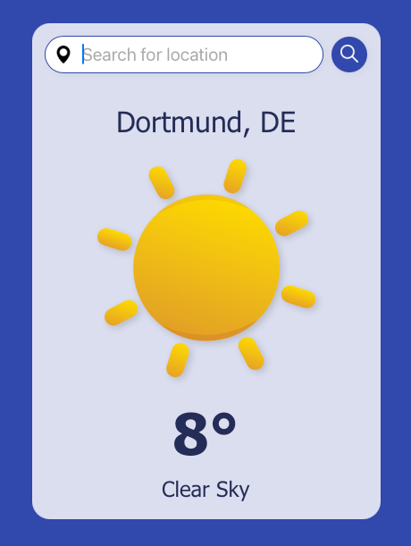

# Weather App 🌤️

<p align="center">
  
  <a href="https://github.com/insomniac2305/weather/graphs/commit-activity" target="_blank"></a>
  
  <a href="https://github.com/insomniac2305/weather/blob/master/LICENSE" target="_blank"></a>
</p>

## Overview

A simple web-based weather application that fetches real-time weather data from OpenWeatherMap. It was built as part of [The Odin Project's curriculum](https://www.theodinproject.com) to practice fetching data from external APIs and manually setting up a build process with webpack.

<p align="center">
  
</p>

## Features

- 🌥️ **Weather Conditions** – Displays temperature, weather descriptions and matching icons.
- 🔍 **Location Search** – Enter a city name to get weather details.
- 📍 **Auto-detect Location** – Fetches weather based on your IP address.

## Technologies Used

- **Frontend**: HTML, CSS, JavaScript
- **APIs**: OpenWeatherMap for weather data, ipapi for IP based location data
- **Build Tools**: Webpack, Babel

## Setup Instructions

1. Clone the repository:
   ```sh
   git clone https://github.com/insomniac2305/weather.git
   cd weather-app
   ```
2. Install dependencies:
   ```sh
   npm install
   ```
3. Start the development server:
   ```sh
   npm start
   ```

## Build & Deployment

1. To create an optimized build for production, run:
   ```sh
   npm run build-prod
   ```
2. This project is configured for deployment via GitHub Pages:
   ```sh
   npm run deploy
   ```

## License

This project is [GPL-3.0](https://github.com/insomniac2305/weather/blob/main/LICENSE) licensed.
